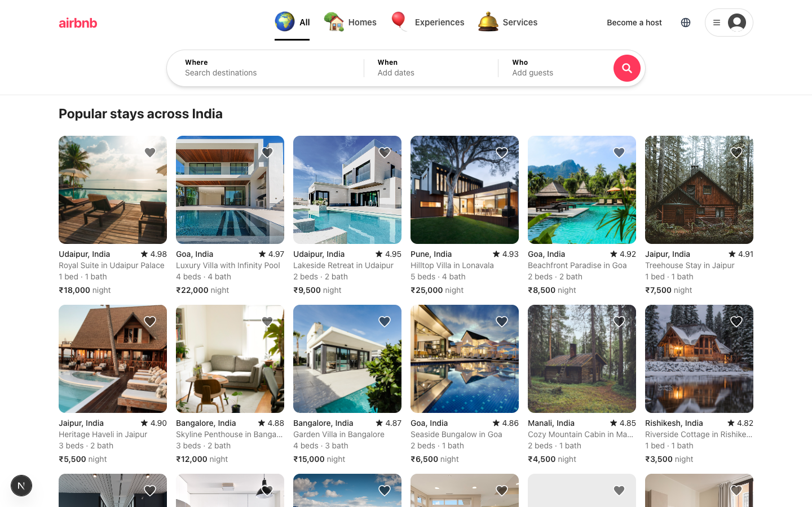
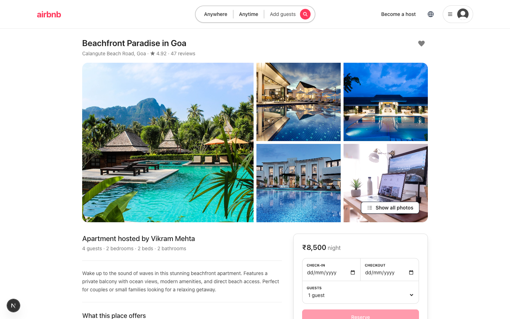
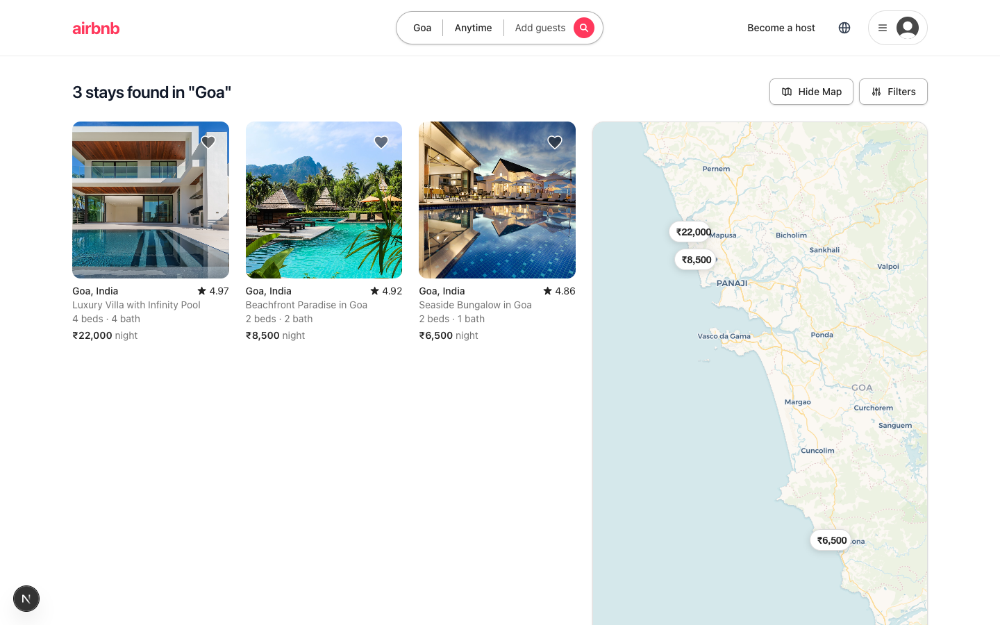

# Airbnb Clone

A full-stack Airbnb clone application built with Next.js (React), Tailwind CSS, Python (FastAPI), and SQLite. This project implements the core features of Airbnb, including browsing listings, viewing property details, user authentication, wishlists, filtering, booking flows, and host management.

## Live Demo & Screenshots

Here is a look at the core features in action:

### 1. Homepage & Discovery
The dynamic homepage features responsive grid layouts mirroring modern aesthetics. Real-time data fetching allows users to seamlessly browse stays, experiences, and services.


### 2. Detailed Property Listings
The property detail page displays rich media galleries, pricing details, host information, available amenities, and a dynamic booking widget with date selection.


### 3. Search & Filtering
The interactive search bar enables complex queries by location, check-in/check-out dates, and guest count. The backend efficiently processes these queries to return targeted results.


## Demo Accounts

The database seeding script creates pre-configured demo accounts to explore different user roles within the application:

- **Traveler (Guest)**: Login as **priya@example.com** to explore the platform from a guest's perspective. You can view bookings, leave reviews, and manage wishlists.
- **Host**: Login as **vikram@example.com** to access the host dashboard. From here, you can manage property listings, view incoming reservations, and monitor host-specific metrics.

## Tech Stack

### Frontend
- **Framework**: Next.js 14 (App Router)
- **Language**: TypeScript
- **Styling**: Tailwind CSS
- **State Management**: React Hooks & Context API
- **Maps**: React-Leaflet for location visualization

### Backend
- **Framework**: FastAPI (Python)
- **Database**: SQLite with SQLAlchemy ORM
- **Authentication**: JWT Tokens & OAuth integration
- **API Documentation**: Swagger UI (auto-generated)

## Core Features

- **Dynamic Homepage**: Browse stays, experiences, and services.
- **Advanced Layout & UI**: Responsive design strictly adhering to modern UI/UX principles, featuring fluid grid layouts, micro-animations, and sticky components.
- **Detailed Listings**: Comprehensive property details, pricing breakdowns, amenities, and host information.
- **Wishlist System**: Save and remove favorite properties effortlessly.
- **Checkout & Bookings**: Calculate nightly rates, cleaning fees, taxes, and complete reservations.
- **Host Dashboard**: Manage listings, view incoming bookings, and track reservations.
- **Search & Filtering**: Search properties by location, dates, and number of guests.
- **Dynamic Seeding**: Realistic seed data for diverse property types, experiences, and professional services.

## Architecture & Data Flow

- The backend exposes RESTful API endpoints via FastAPI routers.
- The frontend consumes data using standard `fetch` APIs within both Server Components and Client Components in Next.js.
- Authentication utilizes a robust JWT strategy to simulate secure user login states, coordinating with backend endpoints.
- Component architecture promotes reusability, utilizing Tailwind CSS utility classes for efficient, scalable styling.

## Setup Instructions

### 1. Backend Setup (FastAPI)

1. Navigate to the backend directory:
   ```bash
   cd backend
   ```
2. Create and activate a Python virtual environment:
   ```bash
   python -m venv venv or python3 -m venv venv
   source venv/bin/activate  # On Windows, use `venv\Scripts\activate`
   ```
3. Install dependencies:
   ```bash
   pip install -r requirements.txt
   ```
4. Seed the database with sample data:
   ```bash
   python seed.py or python3 seed.py
   python seed_extras.py or python3 seed_extras.py
   ```
5. Run the FastAPI development server:
   ```bash
   uvicorn app.main:app --reload
   ```
   The backend API will run on `http://localhost:8000`. API docs are available at `http://localhost:8000/docs`.

### 2. Frontend Setup (Next.js)

1. Navigate to the frontend directory:
   ```bash
   cd frontend
   ```
2. Install dependencies:
   ```bash
   npm install
   ```
3. Run the development server:
   ```bash
   npm run dev
   ```
4. Open your browser and visit `http://localhost:3000`.

---
*Developed with a focus on clean architecture, performance, and responsive design.*
